# Online Classroom 

 

The Online Classroom Web Application allows teachers and students to create accounts, create and join classrooms, and interact in an online classroom environment. Teachers have the option of creating classrooms, posting new assignments, announcements, lessons for the class and also grading the responses that the students submit. Students are able to join classrooms by searching for them with the search bar. Once they join, they will have the option to view lessons, assignments, grades, etc.
  
To access the web-app, please use the link: [newclassroom.net](https://newclassroom.net)
  
Feel free to create an account and get started!
  

## Signing Up as a Teacher

 
Users can register their account as a teacher, which will give them access to classroom creation and they will be able to join other classrooms as teachers.
 

## Creating a Classroom

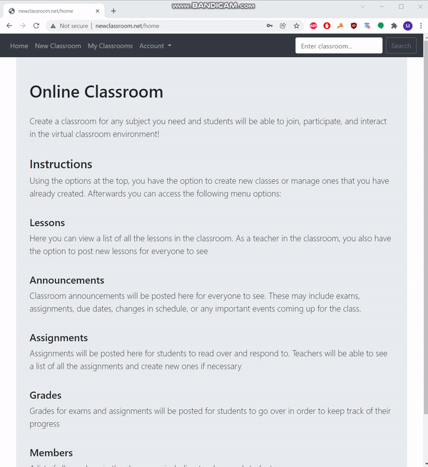

 
Teachers are able to create classrooms very easily by clicking the option at the top of the navigation bar and providing the necessary information for classroom creation
 

## Viewing Classroom as a Teacher

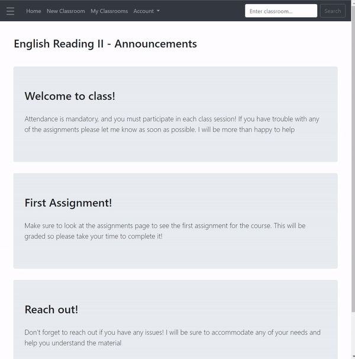

 
Once the teacher has created the classroom or joined another classroom, they will have the options to to open the side menu at the top left, and view announcements, assignments, lessons, grades, and members of the class. The teacher will also have the ability to add new posts and remove members from classrooms
 

## Adding Announcements

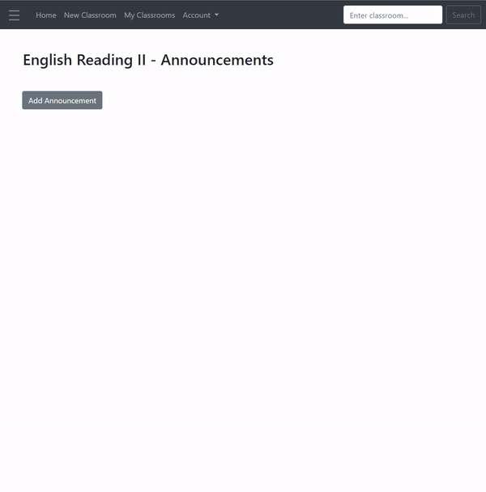

 
Adding announcements for all members to see in the classroom. Announcement topics can range from a welcome greeting, a reminder for an assignment, or just a message that a teacher wants everyone in the classroom to see
 

## Adding Lessons

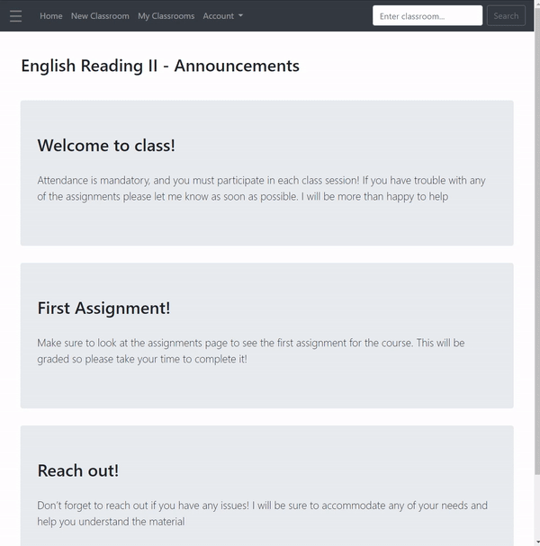

 
Teachers are free to add lessons to the classroom, but have to take note that there is a 2500 character limit on the body of the text, and if an input exceeds that, like in the gif above, an error message will be displayed
 
 
 

 
Here the second lesson is added with an appropriate size and viewed afterwards
 

## Adding Assignments

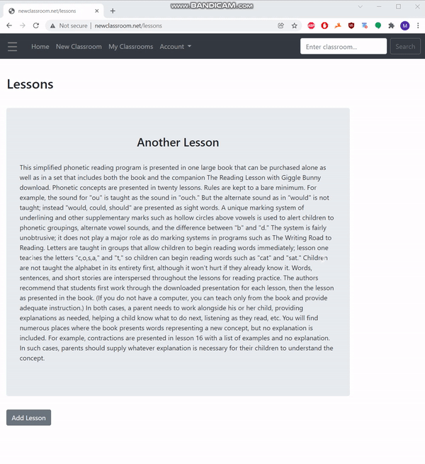

 
Teachers are free to add assignments to the classrooms so that students can view and submit their responses.
 

## Grading Assignments
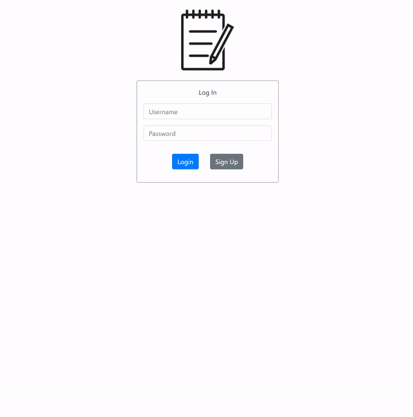

 
Teachers have the option to view student submissions and to submit grades. The grades are open to whatever the teacher would like to assign. They can be either numeric or letter grades (A, B, C+, etc). This gives teachers the flexibility of assigning grades in whatever format they like.
 

## Viewing Grades as Teacher
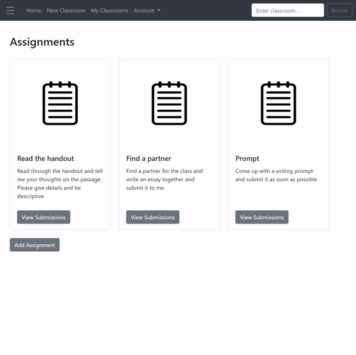

 
Teachers are able to view a table of all the grades according to assignments that have been posted. Once an assignment is selected, they can view the grades for each individual student displayed in a table for that particular assignment.
 

## Removing Students
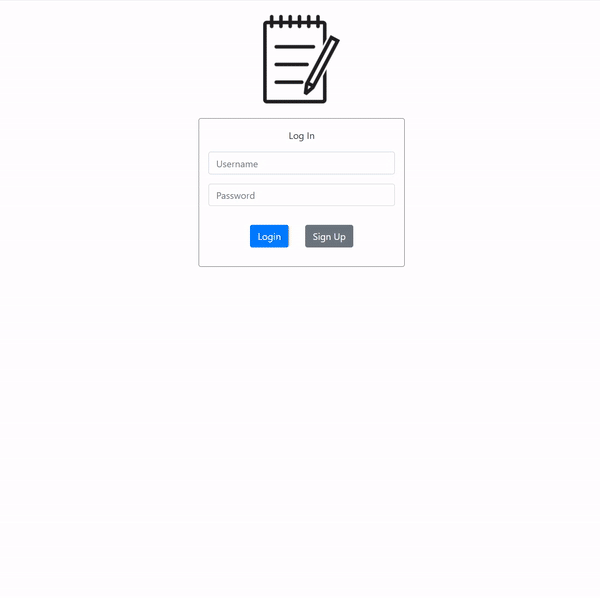

 
If for whatever reason a teacher decides to remove a student from a classroom, he has the option of doing that on the members page of the classroom. Once removed, all of the student's assignment, submission, and grade data will be deleted.
 

## Student Sign up

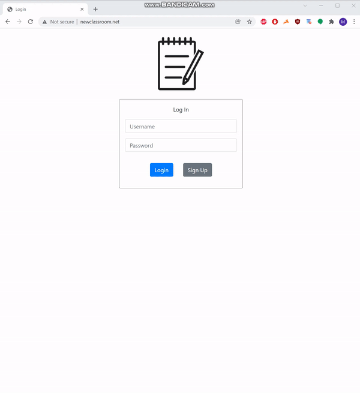

 
Students are also able to easily register for a new account by signing up, similar to the way teachers do. Students however do not have the option of adding a new classroom.
 

## Viewing Classroom as a Student

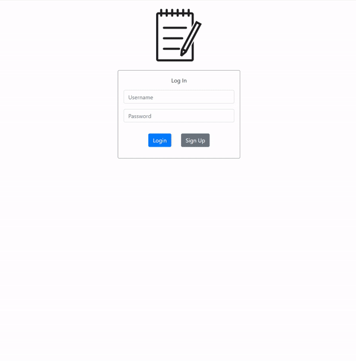

 
The student view of the classroom differs slightly from that of the teachers. Students are able to view all announcements, assignments, and lessons, but not add any new ones.
 

## Submitting Assignment

 
Students can submit their responses to the assignments posted by teachers through the assignments page. If a student resubmits an assignment, it erases the previous submission
 

## Viewing Grades as Student

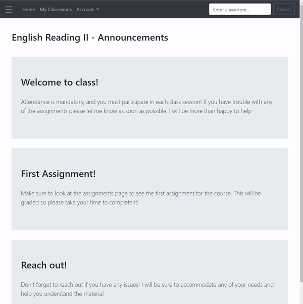

 
Student view of the grades page displays all of their grades for the assignments that have been submitted and graded.
 

## Viewing Members Page as Student

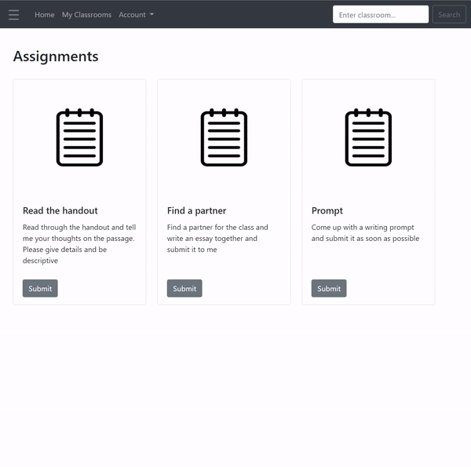

 
Students can also view a list of members, which displays which users are teachers or students
 
